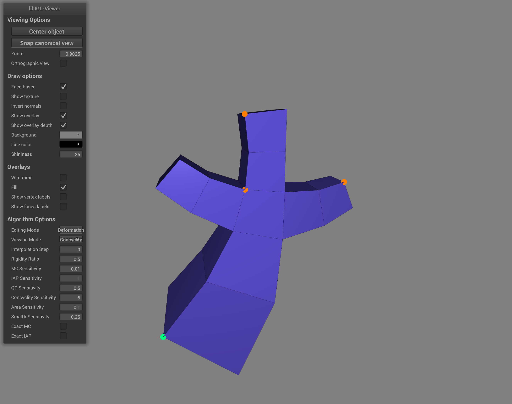

# MoebiusCode

This code serves as a Demo for the paper [Conformal Mesh Deformations with Möbius Transformations](https://www.staff.science.uu.nl/~vaxma001/Conformal_Mesh_Deformations_with_Mobius_Transformations.pdf) by Vaxman *et al.* from SIGGRAPH 2015. The demo uses the optimization package, and specialized traits from the [libhedra](https://github.com/avaxman/libhedra) package, which is in turn based on [libigl](http://libigl.github.io/libigl/) and [Eigen](http://eigen.tuxfamily.org/index.php?title=Main_Page). It implements the following features from the paper:

1. 2D deformation and interpolation using complex numbers.
2. 3D deformation using quaternions.
3. Exact metric conformal (2D and 3D) and intersection-angle preserving (2D).
4. Working with any polyhedral (non-triangular) meshes, where every face undergoes a single M\"obius transformation.

See paper for details on the mathematical formulation of the above.

##Installation

To get the library, use:

```bash
git clone --recursive https://github.com/avaxman/MoebiusCode.git
```

to compile the demo, enter the following commands in a terminal:

```bash
mkdir build
cd build
cmake -DCMAKE_BUILD_TYPE=Release ../
make
```

You can use `cmake-gui` in windows to create a visual studio project. The dependencies are already recusrisvely downloaded and built.


##Editing Meshes

Upon running, the demo will ask to load a mesh. It automatically infers if the mesh is 2D (if the $z$ coordinate is negligible) of 3D, and then would run the respective algorithms. The demo offers the following possibilities:



The editing options are:

| Editing Options                     | Description                                                                         |
| :----------------------- | :---------------------------------------------------------------------------------- |
| `Original`            | Shows the original mesh for comparison. It cannot be edited in this mode.                                     |
| `Deformation`               | Shows the currently deforming mesh. The handles will be spheres, where the green sphere is the currently edited one.|
| `Interpolation`              | Shows the interpolated mesh at the current time frame.|

The viewing options change what is presented per the mesh the is currently shown. Scalar values are on a cool-warm scale in color, where they are first ormalized to $[0,1]$, and values above $1$ are clamped. Thenormalization is made from values of $[0,sensitivity]$. The sensitivities are specific and described as follows. See paper for more details:

| Viewing Options                     | Description                                                                         |
| :----------------------- | :---------------------------------------------------------------------------------- |
| `Mesh View`            | Just the mesh. Note that you can tick off the `wireframe` option to see only the polyhedral lines (rather than the triangulated view).                                 |
| `Edge MC View`               | This shows a special "edge-mesh" that is centered on each edge, and shows the metric conformality values. The value shown is $\left| \frac{\left| cr' \right|}{\left| cr \right|}-1\right|$, where $cr', cr$ are the cross ratio of similar edges in the deformed/interpolated and original mesh respecitvely. The default sensitivity is $0.05$, and controlled by the parameter `MC Sensitivity` |
| `Edge IAP View`              | show the difference between circle intersection angles of deformed/interpolated and original mesh (or: phase of cross ratios) in celsius angles. The default sensitivity is $1^\circ$, and controlled by the parameter `IAP Sensitivity`|
| `Edge IAP View`              | show the difference between circle intersection angles of deformed/interpolated and original mesh (or: phase of cross ratios) in celsius angles. The default sensitivity is $1^\circ$, and controlled by the parameter `IAP Sensitivity`|
| `Edge IAP View`              | show the difference between circle intersection angles of deformed/interpolated and original mesh (or: phase of cross ratios) in celsius angles. The default sensitivity is $1^\circ$, and controlled by the parameter `IAP Sensitivity`|
| `Concyclity`                 | Shows the concyclity of every face, measured as the averaged circle intersection angle of each four vertices in a polygonal face (Triangles are by definition concyclic). This is not a relative measure: expect to see the same colors in the original and deformed/interpolated to see that it is preserved by the algorithm. The default sensitivity is $5^\circ$, and controlled by the parameter `Concyclity Sensitivity` |
| `Face MC Error`              | Like Edge MC error, but for the diagonals of a polygonal face. Not entirely useful, but for completeness.  Uses same parameter and sensitivity like Edge MC.|
| `Face QC Error`              | Measures the quasiconformal error of each deformed/interpolated face relative to the original. The error is measures as $\left|K-1\right|=\left|\frac{\lambda_{max}}{\lambda_{min}}-1\right|$, where $\lambda_{max}, \lambda_{min}$ are the maximum and minimum eigenvalues of the affine map between every two triangles (in triangulated polygonal faces). The default sensitivity is $0.25$, and controlled by the parameter `QC Sensitivity`. |
| `Face Area Error`              | Measures the area distortion between triangles. The error is $\left|\frac{A'}{A}-1\right|$. The default sensitivity is $0.1$, and controlled by the parameter `Area Sensitivity`.   |
| `Face small k Error`              | Measures another sort of normalized quasiconformal error of each deformed/interpolated face relative to the original. The error is measures as $k=\frac{K-1}{K-1}$, where $K$ is defined above (in QC Error). This error is advantageous since it is bounded. The default sensitivity is $0.25$, and controlled by the parameter `Small k Sensitivity`.|

It is possible to perform an exactly-MC preserving deformation and interpolation by tagging `Exact MC`. It is possible to do exact IAP 2D deformation (only) by tagging `Exact IAP`.

The `Rigidity Ratio` parameter controlls the inversion in the M\"obius transformations. It is the $\alpha_{INV}$ as described in the paper. It is by default $0.5$ for 3D meshes, and $0.1$ for 2D meshes. Higher values mean more rigid faces vs. less As-M\"obius-as-possible smoothness.

The Interpolation time step can be controlled by `Interpolation Step`. The interpolation is done between the original (considered as $t=0$) and the currently deformed mesh (considered as $t=1$). Note that it is not bounded; values beyond $[0,1]$ will perform an extrapolation. Remember to re-press this when the deformed mesh changes. It does not update automatically.

The rest of the parameters are regular [libigl](http://libigl.github.io/libigl/) viewing parameters.

##Handles

Positional constraints, as handles, are added by pointing at a vertex and clicking the middle mouse button. Clicking the right mouse button and dragging will move the current handle (green) to the new position marked by the mouse. Handles do not have any effect in interpolated and original modes.

You can navigate between xisting handles by the keys `N,M`. The current handle can be delted by pressing `D`. 

##Other operations

Save the current deformed and interpolated meshes (into polygonal OFF files )by pressing `X`. Press `P` to update the current deformation (in case you deleted the hanndle, changed a parameter, etc.). press `V` and `B` to add and subtract, respectively, the interpolation time step $t$, and compute the interpolation accordingly.

##Implementation

The core of the algorithm is currently part of [libhedra](https://github.com/avaxman/libhedra), as traits classes to its Levenberg-Marquadt solver. Details about the optimization are very similar to those in the paper, but with some changes that will be detailed soon. Meanwhile, the code in the traits `Moebius2DEdgeDeviationTraits.h`, `Moebius3DCornerVarsTraits.h`, and `Moebius2DInterpolationTraits.h` in [libhedra](https://github.com/avaxman/libhedra) reveals them.

The entire algorithm will soon be incorporated into the library, but this demo will remain as showcase nonetheless.

###TODO List:

1. 3D Interpolation: currently solving a few bugs to make that happen.
2. Using the nicer [libhedra](https://github.com/avaxman/libhedra)-based drawing of handles and polyhedral edge lines.
3. using [libhedra](https://github.com/avaxman/libhedra) measures for concyclity etc. It might then change the output slightly (the averaging on polygonal faces is a bit different).
4. Currently the linear solver is Cholesky in Eigen, which is on the slow side. A wrapper for PARDISO will be added as an option to get better performance.

Please complain about bugs, or ask any relevant question by [Amir Vaxman] (a.vaxman@uu.nl) (or open an issue in the repository). If you use this software for comparison, please cite the original paper:

```bibtex
@article{Vaxman:2015,
 author = {Vaxman, Amir and M\"{u}ller, Christian and Weber, Ofir},
 title = {Conformal Mesh Deformations with M\"{o}Bius Transformations},
 journal = {ACM Trans. Graph.},
 issue_date = {August 2015},
 volume = {34},
 number = {4},
 year = {2015},
 pages = {55:1--55:11},
} 
```

